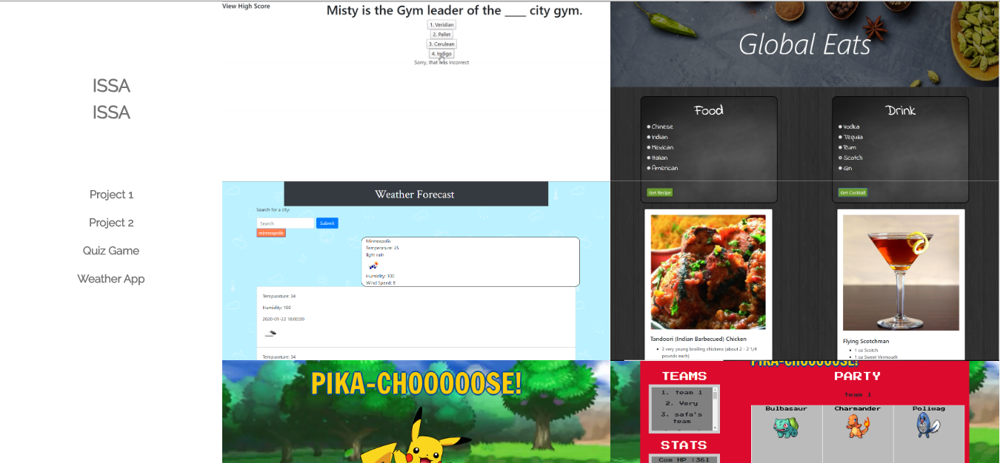

# Portfolio

## Brand Statement

Full-stack developer with a background in Biology working towards gaining an increased amount of knowledge and skill within the ever expanding world of programming. Fully certified as a Full-stack developer who completed the “MERN” coursework with the University of Minnesota. I am driven by a craving to gather more skills and learn more and more everyday. I have worked in the past with other developers to create fully responsive websites that provide features that were requested and applying as much personality to the page as possible.

### Links

Link to Portfolio Page [Link](https://Portfolio/portfolio.html)

Link to LinkedIn Profile [Link](https://www.linkedin.com/in/issa-issa-06159718b/)

Link to GitHub Profile [Link](https://github.com/IssaIssa-Issa)

Link to my personal Resume [Link](assets/resume.pdf)

### Screenshot

Here is a sample of the page. 

